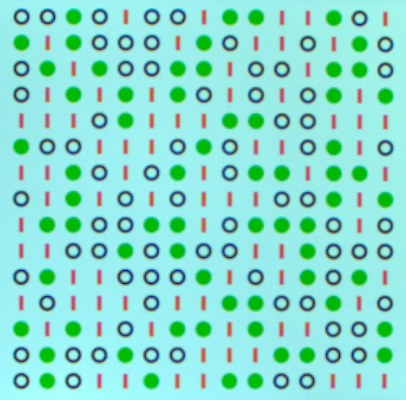
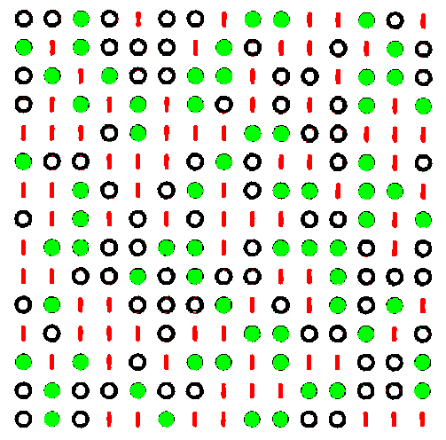

# Module de Reconstruction (rebuild.py)

Ce module gère la reconstruction et l'amélioration des images capturées, notamment la correction des couleurs et la suppression des pixels errants.

##Exemple d'images 
<figure>
    
    <figcaption>Image capturée et recadrée </figcaption>
</figure>

<figure>
    
    <figcaption>Image précédente traitée</figcaption>
</figure>

## Variables Globales

### Paramètres de détection
```python
inter_contours = 10     # Espacement entre les contours
limit_area = 25        # Surface minimale des contours
limit_extrm_angle = 5.0 # Angle limite pour les motifs extrêmes
```

### Masques de couleur
```python
mask = [
    ([38, 179, 38], [38, 179, 38]),  # Vert
    ([0, 0, 255], [201, 201, 255]),  # Rouge
    ([0, 0, 0], [170, 170, 170])     # Noir
]
```

## Fonctions Principales

### Correction des pixels errants
```python
def corriger_pixels_errants(image, couleur_cible, couleur_a_corriger, taille_kernel=3):
    """
    Corrige les pixels d'une couleur spécifique qui sont proches d'une couleur cible.
    
    Args:
        image (np.ndarray): Image à corriger
        couleur_cible (tuple): Couleur cible (B, G, R)
        couleur_a_corriger (tuple): Couleur à corriger (B, G, R)
        taille_kernel (int): Taille du noyau de dilatation
    
    Returns:
        np.ndarray: Image corrigée
    """
```

### Analyse des couleurs dominantes
```python
def couleur_predominante_kmeans(image, k=3):
    """
    Détermine les couleurs dominantes dans une image en utilisant K-means.
    
    Args:
        image (np.ndarray): Image à analyser
        k (int): Nombre de couleurs à extraire
    
    Returns:
        tuple: (centres des couleurs, comptages)
    """
```

### Analyse des couleurs dominantes (sans blanc)
```python
def couleur_predominante_kmeans_exclure_blanc(image, k=3):
    """
    Détermine les couleurs dominantes en excluant le blanc.
    
    Args:
        image (np.ndarray): Image à analyser
        k (int): Nombre de couleurs à extraire
    
    Returns:
        tuple: (centres des couleurs, comptages)
    """
```

### Masquage de la couleur dominante
```python
def masquer_couleur_dominante_en_blanc(image, dominant_color, seuil=80):
    """
    Remplace la couleur dominante par du blanc dans l'image.
    
    Args:
        image (np.ndarray): Image à traiter
        dominant_color (tuple): Couleur dominante à masquer
        seuil (int): Seuil de tolérance pour la couleur
    
    Returns:
        np.ndarray: Image avec la couleur dominante masquée
    """
```

### Recoloration avec couleurs fixes
```python
def recolorer_avec_couleurs_fixes(image, couleurs_dominantes, seuil=80):
    """
    Recolore l'image en utilisant un ensemble de couleurs fixes.
    
    Args:
        image (np.ndarray): Image à recolorer
        couleurs_dominantes (list): Liste des couleurs dominantes
        seuil (int): Seuil de tolérance pour les couleurs
    
    Returns:
        np.ndarray: Image recolorée
    """
```

### Amélioration d'image
```python
def ameliorer_image(image_path="data/mire_photo.png", sortie_path="data/mire_rebuild.png", seuil=80):
    """
    Améliore une image en corrigeant les couleurs et les pixels errants.
    
    Args:
        image_path (str): Chemin vers l'image d'entrée
        sortie_path (str): Chemin pour l'image de sortie
        seuil (int): Seuil de tolérance pour les couleurs
    
    Raises:
        FileNotFoundError: Si l'image d'entrée n'est pas trouvée
    """
```

### Détection de motifs
```python
def fullContoursProcess(img):
    """
    Traite l'image pour détecter et analyser les contours des motifs.
    
    Args:
        img (np.ndarray): Image à traiter
    
    Returns:
        list: Liste des centres des motifs détectés
    """
```

### Angle des motifs rouges
```python
def angleRedPattern(img):
    """
    Détermine l'angle des motifs rouges dans l'image.
    
    Args:
        img (np.ndarray): Image à analyser
    
    Returns:
        float: Angle en degrés
    """
```

### Reconstruction d'image
```python
def rebuild_image(img, H):
    """
    Reconstruit une image en appliquant une transformation inverse.
    
    Args:
        img (np.ndarray): Image à reconstruire
        H (np.ndarray): Matrice de transformation
    
    Returns:
        np.ndarray: Image reconstruite
    """
```

## Utilisation

### Exemple de reconstruction
```python
# Charger l'image
img = cv.imread("data/mire_315a.png")

# Appliquer une transformation
H = np.array([[1, 0, 10],
              [0, 1, 20],
              [0, 0, 1]], dtype=np.float32)

# Reconstruire l'image
rebuilt = rebuild_image(img, H)

# Détecter les motifs
centers = fullContoursProcess(rebuilt)
```

## Notes Techniques

- Utilise l'algorithme K-means pour l'analyse des couleurs
- Les couleurs fixes sont : noir (0,0,0), vert (0,255,0), rouge (0,0,255)
- La correction des pixels errants utilise la dilatation morphologique
- Le seuil de tolérance permet de gérer les variations de couleur
- Les images sont traitées au format BGR (compatible avec OpenCV)
- Les motifs sont détectés par analyse de contours et de couleurs
- La reconstruction utilise des transformations homographiques
- Les angles sont calculés en degrés
- Les masques de couleur sont définis en BGR 